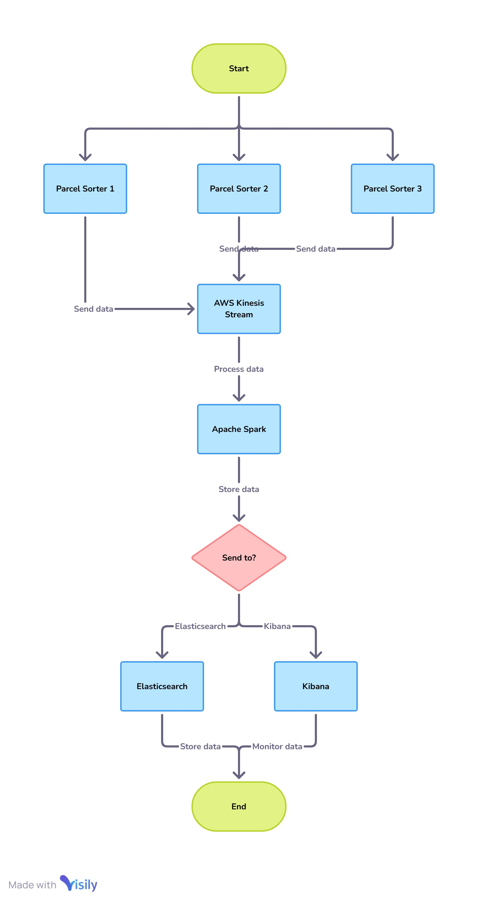

# 📝 Case Study 1: Real-Time Streaming Analytics

*Based on my work at a Leading European Postal & Logistics Group*

---

### 🎯 The Business Challenge

A leading European postal group relied on thousands of automated Parcel Sorter Machines (PSMs) across their network, but they lacked real-time visibility into their performance. When a machine's throughput dropped or error rates spiked, operations managers would only find out hours later, leading to significant delays and operational inefficiencies. The business needed a solution to monitor these machines in near real-time to enable immediate, corrective action.

### 👤 My Role & The Journey

As a Data Engineer on a 5-member development team, I was tasked with helping to design and build the end-to-end streaming data pipeline for this solution. This was my first deep dive into real-time data processing and a fantastic opportunity to move beyond traditional batch ETL. I was responsible for the data ingestion, transformation logic, and the final visualization layer.

### 💡 The Solution & Technical Implementation

I designed and developed a streaming data pipeline on AWS that provided real-time throughput and anomaly detection for the client's PSMs.

#### Solution Architecture

The solution involved:
*   **Ingesting** high-volume, real-time event data from thousands of sorter machines.
*   **Processing and enriching** this streaming data on the fly to calculate key performance indicators like throughput, zone-level statistics, and rejection rates.
*   **Indexing** the processed data into a search-optimized database to power dynamic, auto-refreshing dashboards for operations managers.

### ⚙️ Technical Deep-Dive & Key Learnings

*   **AWS Kinesis & EMR:** We chose **Kinesis Streams** for its ability to scalably ingest the high-velocity data from the sorter machines. This data was then processed using **Spark Streaming on EMR**, which allowed us to apply complex business rules in-flight. My key takeaway was learning how to design for high-throughput, low-latency data pipelines, a completely different paradigm from batch processing.

*   **Elasticsearch & Kibana:** The transformed streaming data was indexed in **Elasticsearch**, chosen for its powerful text search and real-time aggregation capabilities. This enabled us to build dynamic monitoring dashboards in **Kibana**. This taught me that the choice of the final data store is critical; for real-time analytics, a traditional data warehouse would have been too slow.

### 🌟 The Outcome & My Growth

The real-time dashboard I helped build gave operations managers **unprecedented visibility** into their sorter machine performance, allowing them to identify and react to anomalies instantly, thereby **reducing downtime**. This project was my trial-by-fire in streaming data engineering. I learned how to build resilient, high-performance pipelines and saw the direct impact that real-time data can have on business operations.

---

[⬅️ Back to Portfolio Home](../../README.md)