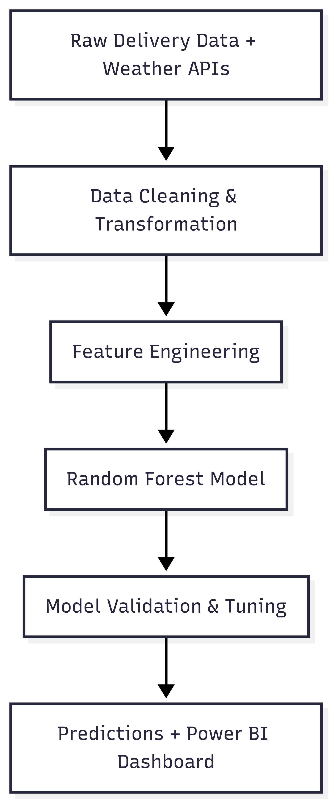

# 📝 Case Study 2: Enhancing Predictive Analytics with Data Quality

*Based on my work at a Leading European Postal & Logistics Group*

---

### 🎯 The Business Challenge

The client had an existing machine learning model (a Random Forest classifier) to predict parcel delivery times. However, its accuracy was inconsistent and had plateaued at around 89%, leading to unreliable delivery estimates for customers. The data science team suspected that the issue was not with the algorithm itself, but with the quality of the data being used to train it.

### 👤 My Role & The Journey

I was brought in as a Data Engineer to partner directly with the data science team. My role was not to build the model, but to re-engineer the entire data pipeline that fed it. This was my first opportunity to work at the intersection of data engineering and machine learning, and my mission was to provide the data scientists with a clean, reliable, and feature-rich dataset.

### 💡 The Solution & Technical Implementation

My solution focused on three key areas of the data pipeline:

#### Data Pipeline for Machine Learning

*   **Data Cleansing & Standardization:** I developed new PySpark jobs to rigorously cleanse the source data, standardizing formats and handling inconsistencies that were previously ignored.
*   **Feature Engineering:** I worked with the data scientists to enrich the core dataset, joining it with non-traditional sources like historical weather data to create new, more predictive features.
*   **Data Model Re-engineering:** I redesigned the final data model used for training, ensuring it was optimized for the Random Forest algorithm and free from the data integrity issues that had plagued the previous version.

### ⚙️ Technical Deep-Dive & Key Learnings

*   **The "Garbage In, Garbage Out" Principle:** This project was a powerful lesson in the direct link between data quality and machine learning performance. My key takeaway was that even the most advanced algorithm cannot overcome flawed data. By focusing on the fundamentals of data quality, we could achieve a greater uplift than by simply tuning the model's hyperparameters.

*   **The Engineer-Scientist Partnership:** I learned the importance of a close partnership between data engineers and data scientists. By understanding their needs, I could build a data pipeline that was not just technically functional, but perfectly tailored to the requirements of the machine learning model.

### 🌟 The Outcome & My Growth

My work on re-engineering the data pipeline directly led to an increase in the prediction model's accuracy **from 89% to 96%**. This resulted in more reliable delivery forecasts for the business and a better experience for their end customers. This project solidified my understanding that data quality is not just a support function; it is a critical enabler of advanced analytics and AI.

---
📌 _Note: This case study is adapted from real-world experience and does not contain any confidential or proprietary information. See [main disclaimer](../../README.md) for details._

[⬅️ Back to Portfolio Home](../../README.md)
