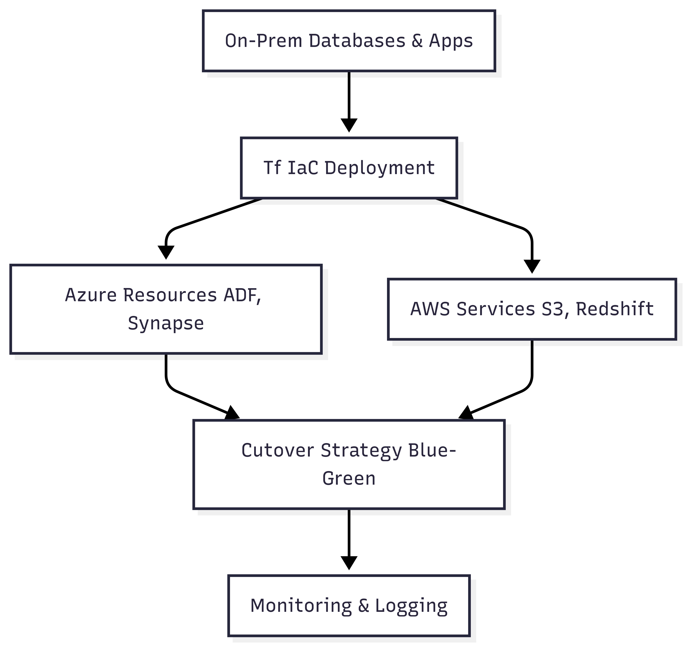

# 📝 Case Study 3: Leading Cloud Migrations & Team Enablement

*Based on my work at a Leading European Postal & Logistics Group*

---

### 🎯 The Business Challenge

The client needed to modernize its entire data ecosystem by migrating dozens of legacy, on-premise BI applications to the cloud. This was a massive undertaking that required not only technical expertise but also strong leadership to guide and upskill the existing teams.

### 👤 My Role & The Journey

I was a key player in this multi-year transformation program. I started as a hands-on Cloud Migration Engineer, executing complex migrations, and grew into a Cloud SME, where I was responsible for mentoring a 20-person "Reporting Factory" team on cloud best practices.

### 💡 The Solution & Technical Implementation

#### Multi-Cloud Migration Overview

*   **Multi-Cloud Migrations:** I gained deep, hands-on experience by executing multiple complex, business-critical cloud migration projects, including **on-premise to Azure**, **on-premise to AWS**, and a strategic **Azure-to-AWS migration**, ensuring minimal downtime.
*   **Team Enablement:** As the Cloud SME for the Reporting Factory, I developed and delivered training sessions on AWS services and data best practices. I created documentation and provided hands-on support to help the team rewrite legacy ETL jobs in **AWS Redshift**, moving them away from older, on-premise tools.

### ⚙️ Technical Deep-Dive & Key Learnings

*   **The Importance of a Migration Playbook:** Executing multiple migrations taught me the value of creating a repeatable playbook. For each migration, we established a clear process: **assess, plan, build, test, and cutover**. This taught me that a successful migration is 90% planning and 10% execution.

*   **Terraform for Consistency:** During the cloud migrations, we used **Terraform for Infrastructure as Code (IaC)**. This was a pivotal learning experience, teaching me the importance of creating repeatable, version-controlled infrastructure to ensure consistency across development, testing, and production environments.

### 🌟 The Outcome & My Growth

The migrations successfully modernized the client's data platform, making it more scalable, performant, and cost-effective. My role as a mentor helped the Reporting Factory team successfully transition their skills to the cloud. This engagement was where I learned that technology is only half the battle; true transformation requires **empowering people** with the knowledge and confidence to use it effectively.

---

📌 _Note: This case study is adapted from real-world experience and does not contain any confidential or proprietary information. See [main disclaimer](../../README.md) for details._

[⬅️ Back to Portfolio Home](../../README.md)
