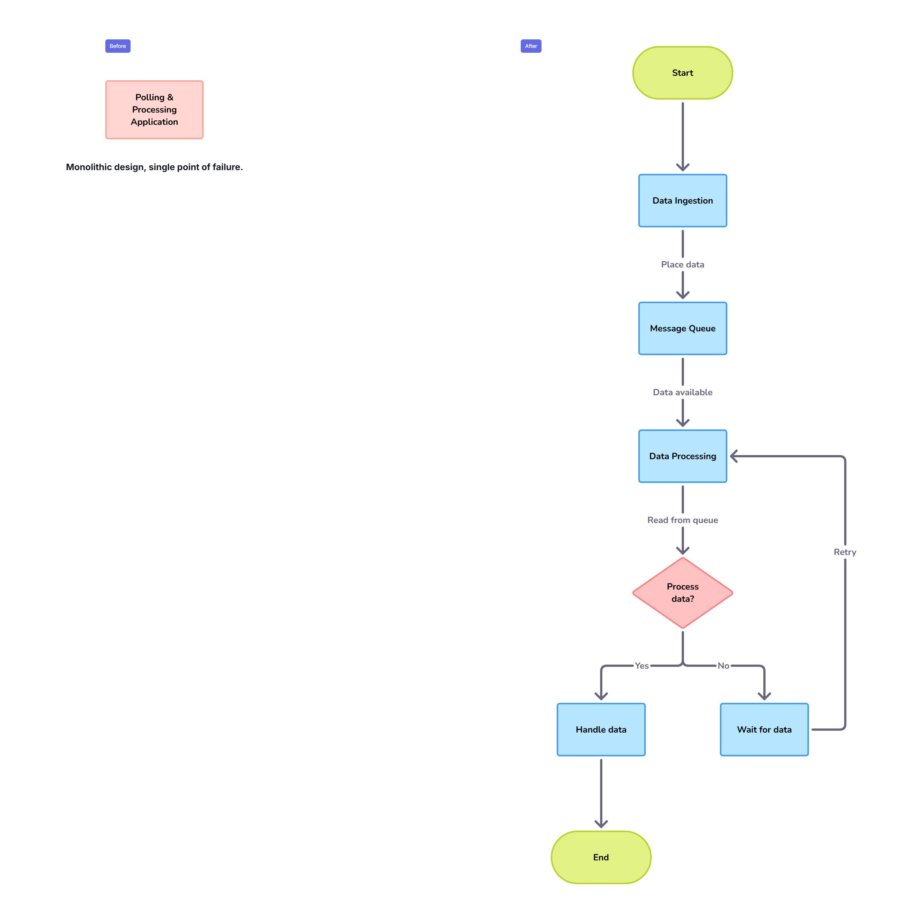

# 📝 Case Study 4: The Leadership Transition - From Engineer to Leader

*Based on my work at a Major Global Courier Service*

---

### 🎯 The Business Challenge

Following a major acquisition, the client was facing significant challenges in unifying its data and support processes. A complex landscape of over 15 applications, spread across on-premise and a new Azure cloud platform, was suffering from frequent production issues and a high number of support escalations, leading to operational instability.

### 👤 My Role & The Journey

I initially joined this account in India as a Development Lead, managing a 15-member team. Recognizing the need for strong leadership on the ground, I was then given the opportunity to move to the UK as the Onsite Support Team Lead. My mission was to stabilize the environment, manage the 14-member cross-geography support team, and act as the primary client point of contact.

### 💡 The Solution & Technical Implementation

#### Decoupling for System Stability

*   **Process Overhaul:** I didn't just fix tickets; I overhauled the entire support process. I established clear communication protocols, implemented a more efficient ticketing workflow in **Jira**, and held regular service review meetings with client stakeholders.
*   **Technical Stabilization:** I led a technical initiative to re-architect a critical polling pipeline, **decoupling its processes** to improve stability and performance.
*   **Development Leadership:** In my initial role, I led the team in designing and implementing new data pipelines using **Databricks** and **Azure Synapse** to process large volumes of logistics data.

### ⚙️ Technical Deep-Dive & Key Learnings

*   **Azure Databricks & Synapse:** We chose Databricks for its powerful Spark engine to handle the heavy data processing workloads, and Azure Synapse as our cloud data warehouse. My key takeaway was understanding how to architect a modern data platform on Azure, **using the right tool for the right job**.

*   **Decoupling with Queues:** The key to stabilizing the pipeline was to introduce a **message queue**. By decoupling data ingestion from processing, we created a more resilient system. If processing failed, ingestion could continue without interruption, preventing data loss. This taught me a fundamental principle of fault-tolerant system design.

### 🌟 The Outcome & My Growth

My process improvements and leadership directly led to a reduction in critical production support escalations by **over 40%**. This stabilized the client's operations and rebuilt trust between business and IT. This engagement was where I transitioned from a senior engineer into a leader, learning invaluable lessons in client engagement, team management, and stabilizing high-pressure environments.

---

📌 _Note: This case study is adapted from real-world experience and does not contain any confidential or proprietary information. See [main disclaimer](../../README.md) for details._

[⬅️ Back to Portfolio Home](../../README.md)
