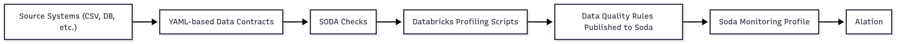
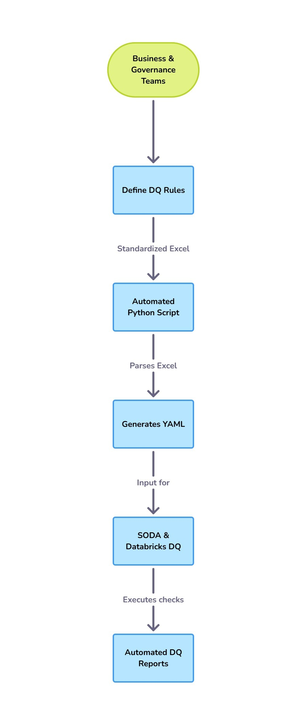

# 📝 Case Study 5: The Strategic Apex - From Leader to Architect

*Based on my work at a Global Supply Chain Leader*

---

### 🎯 The Business Challenge

A global supply chain leader was launching a new Self-Service Analytics platform, but they lacked a formal framework to ensure the data powering it was trustworthy. This posed a major risk to user adoption and the success of their entire data-driven strategy.

### 👤 My Role & The Journey

I was brought in as the Data Quality Lead and Solutions Architect for this greenfield project. My role was not to follow a pre-existing plan, but to define the strategy, design the solution, and lead the implementation from the ground up.

### 💡 The Solution & Technical Implementation

#### Automated Data Quality Framework

*   **Framework Architecture:** I architected a new, end-to-end Data Quality framework using **SODA** and **Databricks**. The core of my solution was an automated workflow that generates executable **YAML Data Contracts** from business rules defined in Excel.
*   **Project Leadership:** I led the Agile project lifecycle using **Jira**, facilitating sprint planning and managing all stakeholder engagement to refine the project scope to the most critical business assets.
*   **Insight Generation:** My team and I defined over **1,500 data quality rules**, uncovering high-impact, actionable business insights that we presented directly to senior leadership to drive process improvements.

### ⚙️ Technical Deep-Dive & Key Learnings

*   **Data Contracts as Code:** The most important architectural decision was to use a declarative, **"Data Contracts as Code"** approach with YAML files. Instead of writing custom Python code for every rule, we defined the *what* (the rule) and let the framework handle the *how* (the execution). My key takeaway is that this approach is infinitely more scalable, maintainable, and collaborative.

*   **The Power of Observability:** Using a modern DQ tool taught me that data quality isn't just about finding errors; it's about **data observability**. It's about providing a platform for governance and collaboration where business and technical teams can come together to understand and improve their data.

### 🌟 The Outcome & My Growth

The framework I designed is projected to address **over 60% of the identified data gaps** for the new analytics platform. The insights we've delivered have already initiated new data governance conversations at a senior level. This role has solidified my transition from a hands-on leader to a data strategist, focusing on architecting governance frameworks that bridge the gap between deep technical solutions and tangible business value.

---

📌 _Note: This case study is adapted from real-world experience and does not contain any confidential or proprietary information. See [main disclaimer](../../README.md) for details._

[⬅️ Back to Portfolio Home](../../README.md)
